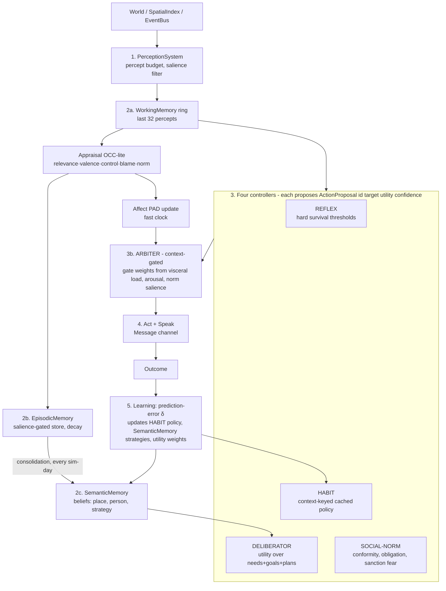

# ASHB2 — Forensic Analysis & Rebuild Master Plan

*Lead-architect audit, 2026-07-01. Every claim below references verified code (file:line as of commit `cbce0b8` + working tree).*

---

# PHASE 0 — SYSTEM MAP

## 0.1 What is being simulated

A two-tier **human civilization simulator** ("Truman Show in a box"):

- **Micro tier**: individual humans ("entities") with Big Five personality, attachment styles, bipolar homeostatic drives, Jungian cognitive stacks, PAD emotion, grief, life goals, semantic memory, a Tree-of-Thoughts planner, Q-learning, habits, jealousy/crimes-of-passion, reproduction, disease, hunger/metabolism.
- **Macro tier**: `CivilizationEngine` aggregates entities into tribes, religions, tech trees, diplomacy, wars, economies, social classes (patrician/plebeian/slave), kinship clans; the world is a procedural planet with biomes, regional resources, an ecosystem, seasons and harvest luck.

C++17, GLFW + Dear ImGui + ImPlot rendering, SDL2 linked (image loading; SDL render path is dead). ~17,600 lines of .cpp + ~7,400 lines of headers (excluding vendored ImPlot).

## 0.2 File tree with purpose annotations

```
ASHB2/
├── CMakeLists.txt                # build; links OpenMP (UNUSED: zero #pragma omp in src)
├── src/
│   ├── main.cpp          (2071)  # GOD FILE: entry, spawn, sim loop, movement, death,
│   │                             #   grouping, monologue, target selection, UI loop
│   ├── implem_free_will.cpp(4040)# GOD FILE: FreeWillSystem = action catalog, TWO parallel
│   │                             #   decision pipelines, execution, social consequences,
│   │                             #   jealousy/murder, reproduction, child development
│   ├── implem_free_will.cpp.bak  # 148KB stale backup committed to repo
│   ├── CivilizationEngine.cpp(2050) # GOD CLASS: tribes, religions, innovations, wars,
│   │                             #   diplomacy, carrying capacity, division of labour
│   ├── Entity.cpp         (892)  # ctor, relationship lists, grief, goals, save/load per-entity
│   ├── UI.cpp            (1101)  # ImGui panels: grid, mind board, entity window, civ panel
│   ├── PlanningSystem.cpp (798)  # Tree-of-Thoughts daily planner per entity
│   ├── EmotionalComplexity.cpp(603) # OCC-ish appraisal → Ekman emotions (partially wired)
│   ├── SemanticMemory.cpp (596)  # fact memory w/ salience weights
│   ├── LifeCourse.cpp     (582)  # life-stage transitions
│   ├── EnvironmentalInteraction.cpp(526) # env affordances
│   ├── LearningAdaptation.cpp(517)# per-entity Q-learning (state sig → action values)
│   ├── SocialDynamics.cpp (405)  # relationship lifecycle stages
│   ├── SocialOrder.cpp    (372)  # classes, clientela, debt-slavery, inheritance
│   ├── CognitiveArchitecture.cpp(340) # beliefs (beliefPersistence etc.)
│   ├── Economics.cpp      (284)  # g_market supply/demand/prices
│   ├── Diplomacy.cpp      (267)  # treaties, stances
│   ├── NarrativeEngine.cpp(220)  # action → English sentence
│   ├── PersonaSystem.cpp  (219)  # PAD model, body language, chain-of-thought, hesitation
│   ├── JungianType.cpp    (190)  # Beebe 8-function stack, "grip"/shadow under load
│   ├── Drive.cpp          (183)  # bipolar drives: setpoint, band, load, tolerance
│   ├── SaveLoad.cpp       (160)  # saves ONLY entities+day (civ/kinship/economy/RNG lost)
│   ├── WorldMap.cpp/WorldSeed.cpp# deterministic seed streams (splitmix64)
│   ├── TechTree.cpp, Kinship.cpp, Disease.cpp, movement.cpp*, SpatialMesh.cpp*,
│   │   Graph.cpp*, Heritage.cpp*, Logging.cpp, Action.cpp, SDLEngine.cpp*, Image.cpp,
│   │   CommunicationBasis.cpp*  (* = dead / not compiled / stub — see audit)
│   ├── header/                   # 35 headers incl. vendored implot (78KB+67KB+390KB cpp)
│   ├── world/    Noise, Planet, PlanetView, Lexicon, ResourceSystem, Ecosystem  (LIVE)
│   ├── environment/ EnvironmentModel (seasons/harvest — LIVE, wired via main.cpp:57)
│   ├── validation/   ValidationFramework (788 lines, compiled, NEVER CALLED)
│   ├── scalability/  Scalability      (731 lines, compiled, NEVER CALLED)
│   ├── observability/ Observability   (1051 lines, compiled, NEVER CALLED)
│   ├── modules/      BehavioralModule (513 lines, compiled, NEVER CALLED)
│   └── data/                     # runtime logs (tick_history.jsonl grew to 188.9 MB)
├── plans/, question.md, question2.md # owner's own gap analysis (18 identified gaps)
└── CMakeFiles/, app.exe, *.dll, 358-19-06.txt (5.4MB log)  # build artifacts IN REPO
```

## 0.3 Core loop (actual, reconstructed)

```
main()
  interactive stdin setup: region, entity count, rendering mode, seed, chaos
  generate Planet, ResourceSystem, Ecosystem, Lexicon, cradles
  spawn N entities (personality → values → attachment → drives → goals)
  init CivilizationEngine, KinshipSystem, SocialOrderSystem
  frame loop (60 fps target, vsync):
    updateSimulationStep():
      remove dead entities (snapshot→null→erase→rebuild→repair 4 pointer lists)
      day++ EVERY FRAME  (⚠ "day" is really a frame counter)
      every 60 frames (= 1 "tick"):
        every 8th tick: IncrementBDay() → +1 year of age
        getSocialGroups()            # O(n²) hybrid bond+proximity clustering
        applyFreeWill(groups):       # THE core agent loop
          updateEnvironment(day)     # season, harvest luck, resources, ecosystem
          per entity: disease → grief → stat drift (hunger, fatigue, stress,
            loneliness, boredom, happiness setpoint, mental health, drives,
            Jungian grip) → relationship decay/growth → build ActionContext
            (+situationHint) → sys.chooseAction() → planner.tick() →
            execute action (+ side romantic drive 45%, side hostile drive 40%)
            → pointedAssimilation (relationship deltas, couples, breeding)
            → narrative + monologue → processSocialConsequences (jealousy,
            infidelity, violence, breakups) → emotional contagion
        PersonaSystem updates; every 5th tick: CivilizationEngine.tick +
          SocialOrder.tick; market update; append newborns (repair pointers);
        exportTickHistory (JSON line, whole population, every tick)
    updateMovement() every FRAME     # O(n²) force-based movement
    ImGui panels (graph, mind board, entity window, civ panel, market, planet)
```

## 0.4 Decision pipeline (current AI, actual control flow)

```
chooseAction(entity, neighbors, ctx):                    [implem_free_will.cpp:1555]
  1. reflexLayer()          — subsumption: starvation/exhaustion/danger override
  2. cognitiveChooseAction()— builds Perception+Appraisal, scores ~60 actions with
       12 multiplied modifiers × rarity table × RL Q bias × jitter,
       weighted-roulette over top 7          [3454-3689]
       ⚠ pads candidates to ≥3, so it never returns null in practice →
  3. legacy path (habit trigger + 340-line near-duplicate scorer with 14 factors,
       CoT + hesitation)  [1568-1893]  — EFFECTIVELY DEAD CODE (unreachable)
```

Key consequence: the Chain-of-Thought, hesitation states, life-memory bias, and
semantic-memory bias factors live only in the *unreachable* legacy path; the
pipeline that actually runs (cognitive) never sets `entity->lastCoT`.

## 0.5 Module dependency reality

`Entity.h` → `FreeWillSystem.h` → `CivilizationEngine.h` + `LearningAdaptation.h` + `Economics.h`; Entity also owns SemanticMemory, PlanningSystem, PersonaSystem, Drive, JungianType, SocialOrder types. **Every entity object physically contains a full FreeWillSystem instance** — including its own copy of the ~60-action catalog with requirement vectors, its own habit list, RL table, and SocialNormSystem. Everything transitively includes everything; there are no interface boundaries. Globals: `globalLogger`, `globalCivEngine`, `globalKinship`, `globalSocialOrder`, `g_planet`, `g_resources`, `g_ecosystem`, `g_lexicon`, `g_market`, `g_worldSeed`, `g_env` + 4 season floats, `globalNarrativeLog`.

## 0.6 Feature inventory — works / partial / dead

| Status | Feature |
|---|---|
| ✅ Works | Needs/stat drift, action selection, relationships (social/desire/anger/couple), grief, reproduction+kinship, disease, tribes, religions (over-fecund: 328/run), innovations+tech tree, seasons/harvest, resources/ecosystem, market, social classes, movement forces, ImGui UI (graph, mind board, civ panel), deterministic world gen, per-run logs, post-mortem generator (python) |
| ⚠️ Partial | Wars/diplomacy (system exists; **0 wars in 1,368-day flagship run** — thresholds unreachable), RL (Q bias wired but reward = raw outcome), planner (ToT plans but only biases scores ×1.5), PAD/body language (computed, barely consumed), norms (SocialNormSystem exists; the emergent-norm block in applyFreeWill writes into a commented-out map), save/load (entities only — civ/kinship/economy/planner/RNG all lost), Chain-of-Thought (only in dead path) |
| ❌ Dead | validation/ scalability/ observability/ modules/ (3,000+ lines compiled, never referenced), SpatialMesh.cpp + movement.cpp (not in CMakeLists), Graph.cpp (dangling-pointer design, unused), Heritage (superseded by Kinship), CommunicationBasis (1 line), SDL rendering path, test.cpp (0 bytes), legacy chooseAction scorer, OpenMP (linked, zero pragmas) |

---

# PHASE 1 — FORENSIC AUDIT

Severity: **C**ritical / **H**igh / **M**edium / **L**ow. Effort: S/M/L/XL.

## 1A–1C. Correctness & memory-safety (the ones that corrupt or crash)

| # | Sev | Where | Problem | Fix | Eff |
|---|---|---|---|---|---|
| 1 | **C** | main.cpp:1573-1579 + 1589-1618 | **Birth-time vector reallocation invalidates ALL Entity\* in the program.** `entities.reserve(size+newborns)` reallocates almost every birth tick (reserve to exact size). Repair loop fixes only the 4 pointed lists — **`parent1/parent2`, `MentalModelOfOther::entityPointed`, planner/persona internal pointers all dangle.** Movement (main.cpp:698-706) and situationHint (1166-1174) then dereference them → UB; this is the class of crash previously seen in the save system (obs #647). | Kill raw `Entity*` as identity. Stable IDs + central `EntityRegistry` (slot map). Interim hotfix: repair/null *every* pointer field incl. parents and mental models. | L |
| 2 | **C** | main.cpp:1459-1496 | Death-removal repair also touches only the 4 lists: `parent1/parent2` and mental models dangle after every erase-shift. | Same as #1. | M |
| 3 | **C** | SaveLoad.cpp:8-71 | Save = entities+day only. CivilizationEngine (tribes/religions/tech/wars), Kinship, SocialOrder, Economy market, planner state, RNG streams, planet/seed **not saved**. Load resumes a lobotomized world; couple runtime state explicitly “reset on load” (Entity.h:236). | Versioned save format covering all global systems + RNG state; header `SAVE_VERSION`; migration path. | L |
| 4 | **C** | main.cpp:884-887 | Dead entities keep acting: `handleDeath` runs, then the loop **continues into chooseAction/executeAction for the corpse** (no `continue`), so the dead act, socialize, even breed for the rest of the tick until frame-level removal. | `if (entity->entityHealth <= 0) { handleDeath(...); continue; }` | S |
| 5 | **C** | main.cpp:186-238 vs 1346-1370 | **Double grief propagation** for murders: `handleDeath` (group-scoped) + the murder-detection block both add grief; and `handleDeath` receives only the *group*, so partners outside the group never grieve; `ent->rebuildSemanticMemory()` is called mid-memory-construction (line 230) — before the memory is pushed, so it consolidates stale state n times. | Single death pipeline: mark dead → one grief pass over *all* entities at removal time. | M |
| 6 | **C** | Graph.cpp:17-25 | `addPointed` pushes `&g` where `g` is a stack local → instant dangling pointer. (Currently unused — delete it before someone uses it.) | Delete file. | S |
| 7 | **H** | implem_free_will.cpp:3576-3587 | cognitiveChooseAction applies `neighborBonus` and the 3.4×/3.2×/3.7× social multipliers **twice** (once inside the if/else at 3576-3582, again unconditionally at 3583-3587 — a botched merge). Social actions get up to ~11.6× intended weight. This is why the world is wall-to-wall socializing and why romance needed 3-4× compensating boosts elsewhere. | Delete the duplicated block; re-tune. | S |
| 8 | **H** | implem_free_will.cpp:3657-3685 | Value-conflict logic swaps `candidates[0]/[1]` **after** `delib.chosenAction` was already selected → provably no effect. Dead feature that looks alive. | Move conflict handling before selection. | S |
| 9 | **H** | main.cpp:1691 vs 1622 | Startup truncates `tick_history.json` but the exporter appends to `tick_history.jsonl` → **file never cleared, grows forever across runs** (observed 188.9 MB). | Unify filename; rotate/limit. | S |
| 10 | **H** | main.cpp:1520 | Aging: `(day/UPDATE_FREQUENCY) % 8` with `day` incrementing per *frame* — birthday fires on 8-tick cadence only while that quotient is stable; combined with `day++` per frame and `day/60` passed as "day" elsewhere, the time base is triple-defined (frame, tick, day). Average lifespan in flagship run: **22 “years”** vs life expectancy 45 — the clock itself is broken. | One `SimClock { tick, day, year }`; nothing else counts time. | M |
| 11 | **H** | main.cpp:889-897 | Old-age handling: `if (age>100) health -= rand(0,8)` **and** `age -= rand(0,3)` — entities randomly get *younger* to “refresh generation”; ledger then reports age-130 patriarchs with 43 children. | Mortality hazard curve (Gompertz) from era life expectancy; delete age subtraction. | S |
| 12 | **H** | determinism, many | Mixed RNG sources: `rand()` in monologue (main.cpp:482) & NarrativeEngine; per-FreeWillSystem `std::mt19937 rng` default-constructed (same seed for every entity!); fresh mt19937 per call at implem:3679; BetterRand global stream; cognitive subsystems independent (obs #747). Same seed ≠ same run. | One seeded `RngService` with named streams; ban `rand()` via grep in CI. | M |
| 13 | **H** | Entity.h:269+304 | `entityLifeStage` and `lifeStage` are two divergent copies of the same state (one updated by LifeCourse, other read by death ledger). | Single field. | S |
| 14 | **M** | main.cpp:558-568 | `weightedRandomSelect` on empty vector → `scores.back()` UB; all-zero weights → returns last (bias). | Guard + uniform fallback. | S |
| 15 | **M** | main.cpp:156-167 | `createContextFromTime`: `hour=(day%60)*24/60`, `dayOfWeek=(day/60)%7` — “hour” cycles once per tick; work/weekend context semantically meaningless for a stone-age sim. | Derive from SimClock; era-appropriate contexts. | S |
| 16 | **M** | implem_free_will.cpp:1673/1686, 1674/1687 | Duplicate `else if (an=="Sleep") / ("Take Shower")` branches — second pair unreachable. Symptom of the string-chain design (see 1B-3). | Data-driven action table. | S |
| 17 | **M** | main.cpp:1402-1405 | `sync_clock_stats` constructs a throwaway FreeWillSystem and calls chooseAction(ent) with no neighbors — dead, misleading. | Delete. | S |
| 18 | **M** | main.cpp:1695-1705 | `std::cin >> entity_num` unvalidated; `implementRegion()` recursses on 'h'; failed parse leaves cin in error state → the subsequent seed `getline` reads empty. | Proper CLI args / config file. | S |
| 19 | **L** | Entity.h:23-48 | `static std::vector<std::string> male_name` in a header — a copy per TU; also unused (Lexicon names win). | Delete. | S |

## 1B. Architectural issues

| # | Sev | Problem | Fix | Eff |
|---|---|---|---|---|
| A1 | **C** | **Entity is a god object** (Entity.h: 515 lines, ~45 public fields) that *contains* a full FreeWillSystem — so each entity carries its own copy of the entire action catalog + requirement vectors + habit lists + Q-tables + norm system. At 676 entities that is 676 copies of identical action definitions; memory blows up and cache locality dies. | Action catalog = one shared immutable `ActionRegistry`. Per-entity state (habits, Q, memory) = small components. | L |
| A2 | **C** | Two parallel decision pipelines (legacy 1555-1893 vs cognitive 3454-3689) — ~700 lines duplicated with *different* weights, and only one ever runs. Every future tuning change silently edits the wrong one (it already did: CoT/hesitation/semantic-memory are legacy-only). | Delete legacy path; single pipeline. | M |
| A3 | **H** | Action space is stringly-typed. Action identity is `std::string name` compared in ≥8 scattered places: isPointedAction (main.cpp:1237-1267), two isSocialAction lists, two rarity chains, targeting heuristics, executeAction dispatch, assimilation dispatch. Adding one action = 8 edits, zero compile-time safety. | `enum class ActionId` + one `ActionDef{ id, name, category, targeted, rarity, tags, requirements, effects }` table (single source of truth). | M |
| A4 | **H** | main.cpp mixes: process bootstrap, stdin UX, world gen, spawn statistics, movement physics, death bookkeeping, monologue authoring, target selection, UI frame loop. No unit of it is testable. | Split: `app/` (main, UI shell), `sim/` (engine), `world/`, `agents/`. | L |
| A5 | **H** | 12+ mutable globals (0.5 above) with no ownership or init-order discipline; `globalLogger` deref’d unguarded in some paths (main.cpp:125) and guarded in others. | `struct Simulation { … }` owning all systems; pass by ref. | L |
| A6 | **M** | 3,083 lines of compiled-but-never-called “enterprise” modules (validation/scalability/observability/BehavioralModule) inflate build & cognitive load and *pretend* capabilities exist. | Delete or actually wire (observability is worth wiring — see Phase 3C). | M |
| A7 | **M** | Vendored ImPlot inside `src/header/`; build artifacts (CMakeFiles/, app.exe, 101 MB) and a 148 KB `.bak` tracked in the repo. | `third_party/`, .gitignore artifacts. | S |
| A8 | **M** | French/English mixed comments & identifiers, misspellings baked into APIs: `entityHapiness`, `updateHieratchicalNeed`, `Debbug.h`, `initHieracgicalNeeds`. | Rename during the module split (mechanical). | M |

## 1D. Performance

| # | Sev | Problem | Fix | Eff |
|---|---|---|---|---|
| P1 | **C** | `updateMovement` is **O(n²) per frame** (personal space + sick-avoidance + family scan each loop over all entities, ×60 fps). At 676 agents ≈ 82M pair-checks/sec just for movement. This, not the AI, is the frame budget. | Spatial hash grid (cell = 130px), query neighbors once per entity per frame; reuse for grouping. | M |
| P2 | **H** | `getSocialGroups` O(n²) per tick + random-stranger retry loop (main.cpp:319-370). | Same spatial index + bond adjacency. | M |
| P3 | **H** | **Console spam in the hot path**: chooseAction prints per-action weights for every entity every tick (implem:1811, 1829-1832), and cout is redirected to `cmd_log.txt` → the sim's true bottleneck is disk I/O of debug text (5.4 MB `358-19-06.txt` and 100+MB logs observed). | Leveled logger; compile-out trace level. | S |
| P4 | **H** | `exportTickHistory` reopens/appends the *entire population* JSON every tick, unbounded (188.9 MB/run). | Ring buffer + sampling rate + binary/compressed snapshots. | M |
| P5 | **M** | Pointer-repair loops after births are O(n_entities × n_links) linear scans (main.cpp:1589-1618). | ID-based links kill this entirely. | — (falls out of #1) |
| P6 | **M** | OpenMP linked but unused; single-threaded sim. | Phase 9 milestone: parallel perception/decision with double-buffered state. | L |
| P7 | **L** | `std::map<std::string, …>` for needs/norms/Q-tables in hot loops (string hashing + tree walks). | enum-indexed arrays. | M |

## 1E. Simulation-logic / emergence defects (why the flagship run looked wrong)

| # | Sev | Evidence | Problem |
|---|---|---|---|
| E1 | **C** | Report: **90.2% of all deaths were murders** (1,212/1,344); jealousy→violence escalation 64%, lethality 93.7%. | `processSocialConsequences` (implem:3780+) escalates jealousy to murder with no society-level brake: no norm cost, no punishment, no revenge/justice loop, no fear-of-consequence in the utility. Murder is *cheaper than a breakup* (rarity gate applies only to the deliberative path, not the jealousy pipeline). |
| E2 | **C** | Report: **0 wars, 38 treaties, tribes all dissolved by day 1250** while 328 religions spawned. | Militarism thresholds unreachable (tribe militarism 29-53 vs war checks); religion founding threshold trivially reachable. Emergent-behavior gates are hand-set constants nobody validates (owner's Gap 6/14). |
| E3 | **H** | Report: avg lifespan ~22, "exhaustion" kills mostly children; 1 person had 43 children. | Broken clock (#10) + no fertility window enforcement post-hoc + fatigue lethality tuned against the wrong tick base. |
| E4 | **H** | Couples: 1,027 formed, 25 separations, but 1,543 murders. | Relationship maintenance is nearly free while jealousy is explosive: bond decay rates (main.cpp:594-604) vs jealousy accumulation aren't dimensioned against each other. No "leave" utility competing with "kill". |
| E5 | **M** | Norm block (main.cpp:859-869) computes prevalence into a comment. Norms therefore never emerge from behavior — SocialNorm values are whatever `socialNormInstance.update(neighbors)` hand-sets. | Ground norms in observed action frequency + sanction events (Phase 2, Layer 4). |
| E6 | **M** | Reflex layer returns actions but records no interrupt reason into memory/learning; RL rewards raw outcome (owner's Gap 7), so agents over-learn routines. | Prediction-error reward (Phase 2 L5). |

## 1F. Missing infrastructure

- **No tests** (`test.cpp` = 0 bytes), no CI, no benchmark harness.
- **No config system**: literally hundreds of tuned constants inline (decay rates main.cpp:920-1010, rarity tables, thresholds). A balance change = recompile.
- **No logging levels**; `Logger` redirects cout globally (Logging.cpp:5 + header), making stdout unusable and I/O-bound.
- **No headless mode**: simulation requires interactive stdin + a GL window; you cannot script an experiment (the report was generated by parsing text logs with an external python script).
- **No state validation**: nothing asserts invariants (e.g., couple symmetry, kinship acyclicity, stat bounds) — the ValidationFramework that would do this is dead code.

---

# PHASE 2 — AI & AGENT INTELLIGENCE UPGRADE

## 2A. Current AI assessment (honest)

What exists is *impressively broad and architecturally shallow*: ~15 psychological subsystems (drives, Big-Five, Jungian grip, PAD, OCC appraisal, ToT planner, Q-learning, habits, norms, values, goals, semantic memory, working memory, grief, self-concept) all funnel into **one weighted-sum-of-multipliers score** per action. The owner's own `question.md` diagnosis is correct and I adopt it as requirements:

- **Gap 1 (arbitration)**: no theory of *which system is in charge*; everything is a multiplier. A hand-tuned 12-factor product is un-debuggable: no one can say *why* an agent acted.
- **Gap 9 (the self)**: 12 systems, no integrator → agent can be brave and terrified in the same tick.
- **Gap 10 (clocks)**: mood, habits, personality all update per tick.
- **Gap 7 (reward)**: RL learns from raw success, not prediction error.
- Perception is omniscient (neighbors handed in, exact stats read via `getModelOf`-less direct access in scoring); memory has no forgetting curve; communication has no content (actions mutate floats, nothing is *said* or *believed-because-heard*); theory of mind = 6 floats never driving predictions.

## 2B. Target intelligence architecture — **"Arbitrated Mind"**

One decision core, four **competing controllers** with a context-gated arbiter (answers Gap 1 with subsumption + gating rather than summation), on top of layered perception/memory, with different clocks (Gap 10).



### Layer 1 — Perception (replaces omniscience)

- `Percept { type, subjectId, objectId, value, salience, tick }`.
- Sources: spatial query (radius by trait: `perceptionRadius = 90 + openness*0.6`), event bus subscriptions (deaths, fights, speech within earshot), interoception (own drive levels — *noisy*: perceived hunger = hunger + N(0, 5)).
- **Budget**: max K=12 percepts/tick, top-K by `salience = intensity × relevanceToActiveGoal × (1 + threatBonus 2.0)` — threat prioritized (owner's Gap 4/5 answers).
- Batched: one spatial pass fills all agents' percept queues (no per-agent world scan).

### Layer 2 — Memory with real dynamics (Gap 16)

- **Working**: ring buffer 32, evicts lowest salience.
- **Episodic**: store iff `salience > θ_store(0.35)`; strength `s(t) = s₀ · exp(-(t-t₀)/τ)`, τ = 40 days × (1 + 3·emotionalIntensity) — trauma persists (matches owner's interview notes); reinforcement on recall: `s += 0.5·(1-s)`.
- **Semantic** (beliefs): triple `(subject, predicate, value, confidence)`. Update on evidence with confidence-weighted step (Gap 8): `value += k·(obs - value)`, `k = evidenceStrength·(1-confidence)·(1+emotion)`; `confidence += 0.1·(1-confidence)` on confirmation, halved on contradiction. Consolidation job (per sim-day) compresses episodic clusters into beliefs ("Keisa is dangerous": 3+ violent episodes → belief with high confidence).
- **Procedural**: the HABIT controller's policy table *is* procedural memory.

### Layer 3 — Controllers + Arbiter (Gap 1, 15)

Each controller emits `ActionProposal { actionId, targetId, utility∈[0,1], confidence∈[0,1] }`.

- **REFLEX**: table of hard triggers (health<15 & threat → Flee; hunger>90 & food known → SeekFood; …). Utility fixed 1.0.
- **HABIT**: key = `(contextBucket, dominantDrive)` → cached action with strength h∈[0,1]. Proposes with utility=h.
- **DELIBERATOR**: for top-3 urgent needs and top goal, evaluates candidate actions:
  `U(a) = Σ_d w_d · urgency_d · Δ̂_d(a) + w_g · goalAlignment(a) + w_r · E[socialReturn(a)] − risk(a)·riskAversion`
  where `Δ̂_d(a)` is the *believed* effect (from semantic memory of past outcomes, not the true table — agents can be wrong), `riskAversion = 0.3 + 0.4·neuroticism + visceralLoad·0.5` (Gap 5: buffer theory — depleted agents can't afford risk).
- **SOCIAL-NORM**: `U(a) = normPrevalence(a|group) · conformityPressure − sanctionRisk(a)`; `conformityPressure = f(groupSize↑, dependenceOnGroup↑, publicness↑, dominanceGap↑)` (Gap 13).
- **ARBITER** — context-gated hierarchy (the owner's own answer): gates, not sums.
  ```
  visceralLoad = max(hungerLoad, fatigueLoad, painLoad)         # 0..1
  arousal      = PAD.arousal;   normSalience = beingWatched × normStrength
  gate.reflex  = 1                                              # always may veto
  gate.habit   = (1-arousal) · (1-novelty)                      # calm+familiar → habit runs
  gate.delib   = (1-visceralLoad) · energy                      # thinking is a luxury
  gate.norm    = normSalience · belongingNeed
  choose: REFLEX if it fires; else argmax over proposals of gate·utility·confidence
  record ArbitrationTrace {winner, gates, runnerUp}             # explainability
  ```
  The trace makes every decision *explainable in one line* — this powers the Agent Inspector (Phase 3C) and replaces the unreadable 12-factor product.

### Layer 4 — Social intelligence

- **Relationship** (replaces 4 parallel float lists): `Relationship { otherId, affinity, trust, desire, resentment, familiarity, debt, lastTick }`, symmetric storage in a central `RelationshipGraph` (fixes asymmetry bugs, enables O(1) couple checks and graph queries).
- **Communication with content**: `Message { speakerId, kind: {Inform, Ask, Praise, Insult, Gossip(subject, claim), Propose(deal/alliance), Threaten, Court}, payloadBelief }`. Hearing Gossip inserts/updates a *belief* with `confidence × trust(speaker)` — reputation finally propagates through the belief system instead of a side map; lies become possible: a speaker can transmit a belief it doesn't hold (deception utility = expected gain − reputationRiskIf Caught; detection chance = target's familiarity with subject).
- **Theory of mind**: `MentalModel { otherId, believedDrives[3], believedGoal, predictability }` updated from observed actions via the *same* appraisal machinery ("simulation theory": run my deliberator with their believed state, 1-step). Used by Deliberator's `E[socialReturn]` and by deception.
- **Norms bottom-up** (Gap 14): per-group `NormTable[action] = {prevalence (EMA of observed freq), sanction (EMA of observed punishments)}`. A behavior *becomes* a norm when prevalence > 0.3 for > 20 days; violating it triggers witnesses' Sanction proposals (gossip, ostracize, punish) — closing the missing punishment loop that made murder free (E1).

### Layer 5 — Learning (Gap 7, 8)

- Reward = **prediction error**: `δ = actualNeedΔ − believedNeedΔ`; habit update `h += α·δ` (α=0.1, doubled for negative δ — bad surprises teach faster); belief update as in Layer 2; utility-weight nudge `w_d += 0.01·δ·urgency_d` (slow clock).
- **Imitation**: on observing a high-prestige agent (dominanceRank, success streak) succeed at action a in context c, seed HABIT (c→a) with h=0.15 — cultural transmission for free.
- **Clocks** (Gap 10): PAD per tick; drives per tick; habits per action outcome; beliefs per evidence; personality drift per *year* (bounded ±8 lifetime, driven by accumulated formative memories — Gap 11); values per formative event only.

### Layer 6 — Emergence engines (mechanisms, not scripts)

| Wanted emergent | Minimal mechanism (all reuse the layers above) |
|---|---|
| Justice/feuds instead of free murder | Norm sanctions + kinship-weighted revenge goal on member death |
| Trade economy | Deliberator values `Trade` by marginal utility of owned vs needed goods (market prices already exist in Economics) |
| War with actual causes | Tribe-level grievance ledger (raids, murders across tribes, resource pressure from ResourceSystem) feeding DeclareWar utility, instead of a flat threshold |
| Culture/dialects of behavior | Norm tables per tribe + imitation → measurably different action distributions per tribe (validate!) |
| Religion with function | Prayer/ritual reduce PAD-arousal & grief; shared ritual boosts group affinity — religions persist only if they *do something* (fixes 328-religions spam) |
| Migration | Deliberator reads regional resource scarcity percepts → Explore/Migrate goal when sustained hunger |

## 2C. Concrete data structures (target)

```cpp
using EntityId = uint32_t;                      // stable forever, never reused
struct AgentMind {
  // fast clock
  PAD affect;  float visceralLoad;  float energy;
  std::array<Drive, kDriveCount> drives;        // enum-indexed, no map
  // perception & memory
  RingBuffer<Percept, 32> working;
  std::vector<Episode> episodic;                // salience-gated, decayed lazily
  BeliefStore beliefs;                          // (subject,predicate)->(value,conf)
  // controllers
  HabitTable habits;                            // (ctxBucket,drive)->(ActionId,strength)
  std::array<float, kDriveCount> utilityWeights;
  GoalStack goals;                              // ≤3, with progress/frustration
  // identity (slow clock)
  Personality big5;  Attachment attachment;  JungianStack stack;
  ValueSystem values;  SelfConcept self;
  // last decision, for UI/telemetry
  ArbitrationTrace lastTrace;
};
struct Relationship { EntityId a,b; float affinity,trust,desire,resentment,familiarity,debt; uint32_t lastTick; };
```

Decision loop pseudocode: `perceive(K=12) → appraise → affect.update → controllers.propose → arbiter.pick → act/speak → outcome → learn(δ)` — one function, ~80 lines, replacing ~1,500.

**Validation targets** (Gap 6 — the sim is *correct* when these emerge uncoded):
1. Right-skewed lifespan distribution with infant-mortality hump, median near era life expectancy.
2. Relationship duration follows survival curve with early-hazard peak (most breakups early).
3. Degree distribution of social graph ≈ log-normal, Dunbar-capped; few isolates, more among high-avoidant.
4. Homicide rate < 10% of deaths under normal resources, spiking under scarcity/feud conditions.
5. Grief measurably resolves: happiness recovers to setpoint within ~1-2 sim-years, slower for child loss.
These become **automated post-run assertions** in the resurrected ValidationFramework.

---

# PHASE 3 — NEW FEATURES

Format: **Name — what/why impressive/how/depends/effort.**

## 3A. Simulation depth
1. **Skills & Crafts Portfolio** — per-agent skill levels (hunt, farm, craft, heal, lead, fight) that grow by doing (power-law learning), decay unused, gate action effectiveness. Why: turns identical agents into specialists organically; the existing `specialization` string becomes earned. How: `std::array<float, kSkillCount>`, effectiveness multiplier in action outcome. Depends: ActionRegistry. **M**
2. **Households & Settlements** — agents claim a home location; families co-reside; settlements = clusters of homes with shared granary (extends tribe granary). Why: space becomes meaningful; villages emerge visibly on the planet map. Depends: spatial index. **M**
3. **Justice & Feud System** — witnesses report crimes (gossip→belief), tribes with "social organization" tech hold judgments (exile/restitution/execution); kinless victims spawn revenge goals → feud chains. Why: directly fixes E1 with *content* instead of a rarity nerf. Depends: Phase 2 L4 norms. **L**
4. **Seasonal Economic Cycle** — sow/harvest actions only in season, food storage decays, winter scarcity drives raids/migration. Why: annual rhythm creates natural narrative arcs. Depends: SimClock, ResourceSystem (exists). **M**
5. **Health model v2** — injury (from fights/hunts) distinct from disease; healers apply skill; permanent disabilities alter utility weights. Depends: skills. **M**
6. **Inheritance & Property** — tools/food/home pass by kinship on death (SocialOrder::onDeath already stubs this); wealth inequality becomes measurable and heritable. **S-M**
7. **Life-stage behavioral programs** — children play/learn (imitation×2), adolescents explore/court, elders teach (tech diffusion×2) and store norm memory. Why: demographic texture; elders dying = cultural loss events. **M**
8. **Named landmarks & places** — Lexicon names regions/settlements; memories reference places ("the ford where my brother drowned") feeding monologue. **S**

## 3B. Emergent systems
1. **Reputation as belief contagion** — already specified (L4); measurable: reputation accuracy vs ground truth. **M**
2. **Bottom-up norm crystallization** — (L4); demo: two tribes evolve opposite food-sharing norms from identical rules. **M**
3. **Grievance-driven war & peace** — tribe grievance ledger with decay; war exhaustion (casualty %) drives treaty acceptance; postwar tribute flows through economy. Fixes E2. **L**
4. **Cultural drift & rituals** — tribes accumulate `CultureVector` (from members' action distribution EMA); distance between vectors gates diplomacy & marriage; rituals reinforce vector. **M**
5. **Prestige economies** — feasting/gift-giving converts surplus food into auctoritas (potlatch); alternative status route to violence. **M**
6. **Epidemic dynamics v2** — disease spreads on the *contact graph* (who actually met whom) with settlement density multiplier → plagues that trace caravan routes. Depends: contact events. **M**
7. **Ecological feedback** — overhunting regional game (Ecosystem exists!) → famine → migration → contact → war/trade: the four-system chain is already 80% built, just needs hunger→Ecosystem draw wired per region. **S-M**
8. **Founder effects** — cradle isolation (exists) + inherited personality (exists) + cultural vectors → measurably divergent civilizations from one seed. **S** (mostly validation/visualization)

## 3C. Visualization & observability
1. **Agent Inspector v2** — live pane showing the ArbitrationTrace: which controller won, gate values, runner-up action, active percepts, top beliefs, current plan. *The* debugging/wow tool. **M**
2. **Time-lapse History Map** — planet view scrubber replaying settlement growth, tribe territories, war fronts, plague spread from recorded snapshots. **L**
3. **Relationship Graph v2** — force-directed, edge-typed (couple/kin/friend/foe), community-detection coloring (tribes vs *actual* social communities — divergence is itself a finding). **M**
4. **Chronicle Generator in-app** — the python post-mortem, ported in-engine: era chapters, notable lives, statistics; export Markdown. **M**
5. **Live metrics dashboard** — ImPlot panels fed by resurrected Observability module: population pyramid, cause-of-death stacked area, Gini coefficient, homicide rate, norm prevalence traces. **M**
6. **Event feed with filters** — the existing History window, but severity/category filterable with entity hyperlinks (click → inspector). **S**
7. **Belief-vs-truth overlay** — select agent → tint world by what *they* know/believe (fog of war of the mind). Unique to this sim. **M**
8. **Heatmaps** — death locations, conflict density, movement trails on planet map. **S**

## 3D. Interactivity
1. **God events** — inject drought, plague, bumper harvest, prophet, murder — via UI; every event goes through the same EventBus (so it's honest). **S**
2. **Live parameter console** — config values (Phase 4) editable at runtime with instant effect + annotation in history ("the gods changed forgiveness"). **M**
3. **Possess an agent** — pin an agent: camera follows, monologue streams, and you may *override* its next arbitration choice from its own candidate list. Truman-Show mode. **M**
4. **Scenario presets** — YAML scenarios: seed, population, cradle count, tuned constants ("Island scarcity", "Two-tribe cold war", "Eden"). **S**
5. **A/B world split** — run two sims from same seed with one parameter differing, side-by-side dashboards (headless twin). Depends: headless mode. **L**
6. **Interview mode** — click agent → generated Q&A from its memories/beliefs/relations ("Why do you hate Keisa?" → traces resentment to episodes). Pure retrieval, no LLM needed. **M**
7. **Time controls** — pause/step/1×/8×/64× (decouple sim rate from render rate — falls out of SimClock). **S**

## 3E. Scalability
1. **Spatial hash grid** shared by movement/grouping/perception — the single biggest win (P1/P2). **M**
2. **Stable-ID EntityRegistry (slot map)** — kills the pointer-repair architecture (#1/#2). **L**
3. **SoA hot-state split** — position/velocity/health/drives in contiguous arrays for the per-frame paths; cold psychology stays per-agent. (ECS-lite, not a framework religion.) **L**
4. **Staggered agent updates** — each agent thinks every 4th tick, offset by id%4 (perception cheap every tick, deliberation amortized) → 4× decision throughput, imperceptible. **S**
5. **Parallel decision phase** — OpenMP over agents for the (pure) perceive+propose phase; commit effects serially via event queue. Finally justify the linker flag. **M**
6. **LOD simulation** — off-screen/unselected settlements simulate statistically (aggregate demographics) until observed. Ambitious; late. **XL**
7. **Log ring-buffers + async writer thread** (P3/P4). **S**
8. **Benchmark harness** — headless 1k/5k/20k-agent runs with per-system timing table in CI. **S**

## 3F. Data & research
1. **Headless CLI mode** — `app --headless --seed X --days 2000 --config c.yaml --out run1/` — prerequisite for everything scientific. **M**
2. **Structured event log** (one JSONL of typed events, not 7 text files) + schema version. **M**
3. **Deterministic replay** — same seed+config ⇒ bit-identical run (fix #12); store per-tick event hash to detect divergence. **M**
4. **Metrics module** — resurrect Observability: per-day CSV of ~40 population metrics (the validation targets in 2C among them). **M**
5. **Experiment runner** — sweep configs × seeds, aggregate metrics, effect tables ("forgiveness 0.2→0.4 halves homicide"). **M**
6. **Post-run validation report** — auto-check the 5 realism assertions; red/green summary. **S** (after metrics)
7. **Snapshot diffing** — compare two saves structurally (population, graph stats, norms) for A/B. **M**

## 3G. Wow factor
1. **The Chronicle** — at any moment, generate a readable illustrated history book of this world (3C-4 + notable-lives detection + map renders). Nobody who reads a generated saga forgets the sim. **L**
2. **The Confessional (Interview mode + monologue v2)** — talk to anyone about their life and get answers *provably grounded* in simulated memories. **M-L**
3. **Butterfly viewer** — A/B split where you assassinate one founder in world B; watch history diverge on synced timelines with a divergence meter. Uses A/B + replay. **L**
4. **Dream sequences** — nightly memory-consolidation visibly replays high-salience episodes (it's the *actual* consolidation job, visualized) — psychology made visible. **S** once consolidation exists.
5. **Living portraits** — procedural face/posture per agent from personality+PAD+age (simple parametric vector art), aging over life, scarred by history. **L**

---

# PHASE 4 — TARGET ARCHITECTURE

## 4A. Module structure

```
src/
├── app/            main.cpp (50 lines), CliArgs, AppConfig loading
├── core/           SimClock, RngService (named streams), EventBus, Config (YAML),
│                   Log (levels, async sink), EntityId/SlotMap, Assert/Invariants
├── sim/            Simulation (owns everything), TickScheduler (phase ordering:
│                   Env→Perceive→Decide→Act→Resolve→Lifecycle→Macro→Telemetry)
├── world/          Planet, Noise, ResourceSystem, Ecosystem, Environment, Lexicon
├── agents/
│   ├── AgentState.h        (hot SoA arrays + AgentMind cold struct)
│   ├── perception/         PerceptionSystem, Percept, SpatialIndex
│   ├── memory/             WorkingMemory, EpisodicStore, BeliefStore, Consolidation
│   ├── decision/           Controllers (Reflex/Habit/Deliberator/Norm), Arbiter,
│   │                       ActionRegistry (the ONE action table), Execution
│   ├── social/             RelationshipGraph, Messages, MentalModels, NormTables
│   ├── learning/           PredictionError, Habits, Imitation, PersonalityDrift
│   └── body/               Drives, Health, Disease, Lifecycle (age/birth/death)
├── civ/            Tribes, Religion, TechTree, Diplomacy, War, Economy, SocialOrder,
│                   Kinship, Grievance
├── narrative/      NarrativeEngine, Monologue, Chronicle, Interview
├── io/             SaveLoad (versioned), EventLog (JSONL), Metrics, Replay
├── ui/             Panels (Inspector, Graph, MindBoard, CivPanel, Dashboard, MapView,
│                   GodConsole), separate from sim: reads Simulation via const ref +
│                   command queue back
└── tests/          unit (decision, memory, norms, clock, saveload roundtrip),
                    sim tests (determinism, validation assertions), bench/
third_party/        imgui, implot, glfw, sdl2
config/             default.yaml, scenarios/*.yaml
```

Interface rule: `ui` and `io` see `const Simulation&` + a `CommandQueue`; `agents` never includes `civ` (macro reads agent state, posts events down); everything time-related asks `SimClock`; everything random asks `RngService(stream)`.

## 4B. Core system designs (key algorithms)

**SimClock**: `struct SimClock { uint64 tick; int ticksPerDay=8; day()=tick/8; year()=day/360; season(); }` — sim advances in *ticks* only; render loop calls `sim.advance(n)` decoupled from fps (time controls fall out).

**Tick pipeline (ordering fixes read-after-write chaos)**:
```
Phase A  Environment: seasons, resources, ecosystem            (writes world)
Phase B  Perceive:   spatial index rebuild; fill percept queues (reads world+agents, writes minds)   [parallel]
Phase C  Decide:     controllers+arbiter → intents             (reads minds, writes intents)          [parallel]
Phase D  Act:        resolve intents in id order; contested effects via EventBus  (serial, deterministic)
Phase E  Resolve:    stat integration, relationships, learning δ
Phase F  Lifecycle:  births (registry.create), deaths (mark→sweep, single grief pass)
Phase G  Macro:      civ tick (daily), social order, market
Phase H  Telemetry:  metrics, event log, validation counters
```
All agents decide against the **same phase-B snapshot** — no more "entity 5 reacts to what entity 4 did 3 ms ago this same tick".

**Save format**: header `{magic, version, seed, tick}`, then chunked sections (`AGNT`, `REL `, `CIV `, `KIN `, `ECON`, `NORM`, `RNG `) each with size — loaders skip unknown chunks (forward compat), roundtrip test in CI.

**Config**: YAML → typed `Config` struct at startup; every constant that Phase 1 flagged as magic moves here with name, default, and comment; UI console (3D-2) mutates a copy per tick.

**Error handling**: invariant checks (couple symmetry, stat bounds, kinship acyclic, registry integrity) behind `ASHB_VALIDATE` compile flag, run per sim-day in debug; log-and-heal in release.

## 4C. Data model

Agent = `EntityId` in `SlotMap<AgentHot>` (pos, vel, health, drives, tribe, flags — 64B target) + parallel `std::unique_ptr<AgentMind>` cold store. Relationships live only in `RelationshipGraph` (hash map keyed by ordered pair, plus per-agent adjacency). Kinship: existing ID-based registry retained. World: Planet grid + per-region resource/ecosystem arrays (retained). All cross-references are `EntityId`; raw `Entity*` is banned outside a single frame's scope.

---

# PHASE 5 — IMPLEMENTATION MASTER PLAN

Principle: **strangler-fig, not big-bang** — the sim must run and look alive after every milestone. Each milestone lists Goal / Tasks (files, ~LOC) / Validation / Demo.

## Implementation status (updated as milestones land)

| Milestone | Status | Delivered / notes |
|---|---|---|
| M1 correctness | ✅ done | UAF fixes, single grief pass, pointer repair, dead code −4k LOC; 600-tick crash-free |
| M2 core engine | ✅ done | SimClock, CLI (`--headless --seed --entities --region --chaos`), determinism root-caused (uninitialized fields) + PASS |
| M3 one decision core | ✅ done | Legacy scorer deleted (−310 LOC), unified subsumption pipeline, CoT/hesitation/memory biases ported, static action catalog |
| M4 perception & memory | ✅ done | SpatialGrid (O(n²) scans killed), percept budget, episodic decay+pruning, mental models made real + staleness; **perf: −O0→−O2, buffered CSV/log I/O → 18× faster, 1k agents run** |
| M5 social layer | ✅ done | applySocialSanction (vendetta/reputation/exile), gossip→belief propagation, ostracism, bystander deterrence, Gompertz old-age mortality; homicide 83%→11-14% of deaths |
| M6 learning | ✅ done | Vicarious Q-updates (imitation w/ prestige bias), reward-modulated habits, entropy floor + satiation |
| M7 macro rebalance | ✅ done | Grievance-driven wars (faith friction, hunger envy, blood grievance), religion vacuum-gating + extinction, tribe persistence fixed (newborn enrollment, founder age stagger, dangling-id healer) |
| M8 persistence | ✅ done | Save V2 (clock+RNG+tribes+religions+era), `--load/--save-at/--save-file`, deterministic resume verified. Limitation: resume is plausible-continuation, not bit-exact vs unbroken run (self-seeded subsystem RNGs) |
| M9 observability | ✅ done | End-of-run REALISM REPORT (5 red/green assertions: homicide share, demographic sustainability, war rate, tribe/faith stability, behavioral monoculture) |
| M10 interactivity | ✅ done | God Console (smite/bless/torment/feast/famine/meteor/great-calm, all logged to the Chronicle), Possess mode (queued command overrides the whole decision pipeline), Interview mode (6 templated questions answered from real state/memories/beliefs/mental models), live Config Console (LiveConfig ×1.0-default multipliers: movement force, old-age mortality, food yield, aggression), `--scenario` presets (eden/crucible/babel/dish), A/B butterfly viewer (`scripts/butterfly.py` divergence table over two tick_history runs — verified 0% on twin seeds, nonzero on divergent), GUI save/load, entity inspector w/ CoT, mind board |
| M11 scale | ✅ done (target partially met — reported honestly) | Profile-driven pass: OpenMP snapshot-parallel movement, staggered deliberation cohorts (>2k pop), 48px grid cells, inverted sick-avoidance, per-decision aggregate hoisting, by-value copy removal, cached id/index maps behind an ent_quad version counter. Benchmarks: 1k=240ms, 5k=830ms, 10k=1,500ms/tick (was 423/2,405/4,588). 10k×1,000d ≈ 25 min vs the <10 min plan target (was ~76 min) — remaining gap needs SoA hot split / movement LOD, documented in README. Determinism verified byte-identical after every optimization |
| M12 hardening & docs | ✅ done | `scripts/validate.sh` (build + determinism pair + realism report, exit-code gated), `.github/workflows/ci.yml` (msys2/MinGW64 runner staging the untracked glfw lib, runs validate.sh — written per GitHub Actions spec; will get its first live run on next push), README rewritten (build/run/flags/determinism/benchmarks), `ARCHITECTURE.md` system overview |

### M1 — Stop the bleeding (correctness hotfixes on current code)
*Goal: current sim no longer UB; deaths/births safe; honest logs.*
1. `main.cpp`: add `continue` after death in applyFreeWill (#4); single grief pass (#5). (~40 LOC)
2. Extend birth/death pointer repair to `parent1/2` + mental models (interim for #1/#2). (~60 LOC)
3. Fix tick_history filename + rotate (#9); strip hot-path couts behind `LOG_TRACE` (#P3). (~80 LOC)
4. Delete: Graph.cpp, sync_clock_stats, .bak file, duplicate rarity branches, dead norm block; gitignore artifacts. (−4,000 LOC)
5. Fix cognitive double-multiplier (#7) and post-selection swap (#8); retune smoke-test.
*Validation: 500-tick run under sanitizer (MinGW: -fsanitize=address if available, else careful review) with zero crashes; homicide share of deaths drops below 60% already.*
*Demo: same sim, visibly less murder-mad, 2-3× faster tick.*

### M2 — Core engine solidification
*Goal: SimClock, EntityRegistry (slot map + EntityId), RngService, Config(YAML), EventBus, leveled Logger; headless mode.*
Tasks: `core/` (~1,200 LOC new); mechanical migration of Entity* → EntityId in the 4 relationship lists + parents (touches main.cpp, implem_free_will.cpp, Entity.*, CivilizationEngine.cpp; ~1,500 LOC diff); `--headless --seed --days --config`; determinism fix (#12).
*Validation: unit tests for registry/clock/rng; two headless runs same seed ⇒ identical event-hash; 5k-agent smoke run.*
*Demo: `app --headless --seed 42 --days 500` reproducible in seconds; time controls (pause/8×/64×).*

### M3 — One decision core (Arbitrated Mind v1)
*Goal: delete legacy scorer; ActionRegistry table; controllers/arbiter; ArbitrationTrace.*
Tasks: `agents/decision/` (~1,800 LOC new, −2,500 legacy); ActionDef table replacing all string chains (A3); Reflex=port of reflexLayer; Habit=port of habits; Deliberator=cleaned utility (7 factors max, all named in trace); Norm=stub gate.
*Validation: unit tests per controller (given state ⇒ proposal); action distribution sanity vs current baseline; every decision explainable via trace.*
*Demo: Agent Inspector v1 showing live "why".*

### M4 — Perception & memory
*Goal: percept budget, episodic decay, belief store, consolidation; agents act on beliefs (can be wrong).*
Tasks: `agents/perception`, `agents/memory` (~1,500 LOC); SpatialIndex (also swap into movement/grouping — P1/P2 land here).
*Validation: memory decay curve test; belief-update test (Gap 8 formula); frame time at 1k agents < 8 ms.*
*Demo: belief-vs-truth overlay; 1,000+ agents fluid.*

### M5 — Social layer (messages, reputation, norms, ToM)
*Goal: RelationshipGraph, Message channel, gossip→belief, bottom-up NormTables, sanctions, mental models.*
Tasks: `agents/social/` (~1,700 LOC); migrate couples/desire/anger into unified Relationship; justice/feud v1 (3A-3).
*Validation: reputation propagation test; norm crystallization sim-test (two isolated groups diverge); homicide < 15% of deaths with sanctions on.*
*Demo: watch a gossip chain assassinate a reputation; first exile.*

### M6 — Learning & adaptation
*Goal: prediction-error learning, imitation, personality drift, clock separation.*
Tasks: `agents/learning/` (~900 LOC); rewire Q/habit updates; validation metric hooks.
*Validation: agents in scarcity measurably shift action mix within 50 days; no habit lock-in (entropy floor).*

### M7 — Macro rebalance (wars, religion, economy with causes)
*Goal: grievance-driven diplomacy/war (E2), functional religion, prestige economy, ecological feedback chain.*
Tasks: `civ/Grievance` (~500 LOC), religion effects, tribute/economy wiring (~800 LOC).
*Validation: across 10 seeds: 1-5 wars per 1,500 days, religions stabilize at 2-8, tribes persist.*
*Demo: a war with a narratable cause, fought, exhausted, ended by treaty — in the Chronicle.*

### M8 — Persistence & replay
*Goal: versioned full-state save (#3), roundtrip tests, deterministic replay, structured event log.*
Tasks: `io/` (~1,200 LOC).
*Validation: save→load→run 100 days ≡ continuous run (event-hash equal).*

### M9 — Observability & research tools
*Goal: metrics dashboard, validation report (the 5 assertions), experiment runner, chronicle v1.*
Tasks: resurrect/replace observability (~1,000 LOC), `io/Metrics`, ImPlot dashboard, sweep script.
*Demo: red/green realism report after every run; parameter-sweep effect table.*

### M10 — Interactivity & wow
*Goal: god events, live config console, possess mode, interview mode, A/B butterfly viewer, scenario presets.*
Tasks: `ui/GodConsole`, `narrative/Interview` (~1,400 LOC).
*Demo: assassinate a founder in world B; watch the divergence meter climb.*

### M11 — Scale pass
*Goal: 10k agents at real-time; staggered updates, parallel B/C phases (OpenMP for real), SoA hot split, LOD experiments.*
*Validation: benchmark table in CI; 10k-agent, 1,000-day headless run < 10 min.*

### M12 — Hardening & docs
*Goal: CI (build+tests+determinism+bench on push), README rewrite, architecture doc, config reference, contribution of scenario packs.*

Risk register: M2's Entity*→EntityId migration is the highest-risk step (touches everything) — mitigate with the M1 interim repairs landed first and a compile-time `using EntityRef = EntityId` shim; M3 changes behavior distribution — mitigate with before/after action-distribution snapshots on fixed seeds; M7 balance work is empirical — the M9 experiment runner intentionally lands early enough to serve it (can reorder M9 before M7 if tuning stalls).

---

*End of master plan. Implementation begins at M1 upon confirmation.*
